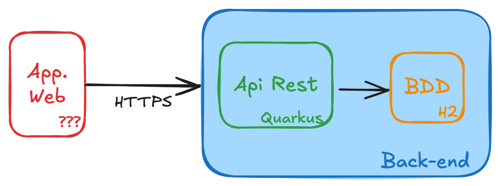

# Rappels

## Sujet : Faire Burger Quizz !
Vous avez 4 séances de TD/TP pour  produire un site web qui permettent de répondre à des questions et  donne le score.

## Environnement
L'ensemble des  4 TD/TP sont à réaliser sur **_Gitpod_**.
Vous devez réutiliser le compte que vous avez crée durant la première séance.

## Déroulement

Comme au premier TP, vous devez suivre le même processus que pour contribuer à un projet:
1. Dupliquer (**Forker**) le projet github
1. Modifier / compléter des fichier du repo. forké
1. Commiter vos modifs sur votre repo.
1. Proposer vos modifications sur le repo. parent (**PullRequest**)

## Architecture
L'architecture générale de  l'application  Burger Quizz est la suivante :

Une application web consomme une API Rest Quarkus  qui s'appuie sur une base de données relationnelles en  mémoire **H2**.

## TP3 - Choix stack Front-End

Votre client  veut une api de quizz en français qui :
* Permet à un utilisateur de passer le quizz.
* Indique le score du joueur à la fin du quizz.
* Met en avant tout ces réseaux sociaux.
* Une page "About".
* Une image fix avec un "?"

**L'objectif de ce quatrième TP est de rendre l'Application Accessible**

# Fork du projet
L'objectif est de créer une copie du projet 'miage-numres-step4' sur votre compte github.

1. Se rendre sur le projet github [miage-numres-step4] (https://github.com/aepsilon-tek/miage-numres-step4)
1. Fork du projet grâce au bouton **Fork**

# Lancement de GitPod

Pour utiliser  **GitPod** avec votre projet forké, il suffit d'ouvrir  l'url suivant dans votre navigateur :
**https://gitpod.io/#** + **URL_REPO_GITHUB**

Avec un repo _https://github.com/miage3-ae/miage-numres-step4_ alors l'url est : **https://gitpod.io/#https://github.com/miage3-ae/miage-numres-step4**

# ViteJs
 Vite est un outil de construction qui vise à fournir une expérience de développement plus rapide et plus simple pour les projets Web modernes. Il se compose de deux grandes parties :
 - Un serveur de développement qui offre de riches améliorations de
   fonctionnalités par rapport aux modules ES natifs, par exemple un
   remplacement de module à chaud (HMR) extrêmement rapide.
 - Une commande de build qui regroupe votre code avec Rollup,
   préconfiguré pour générer des ressources statiques hautement
   optimisées pour la production.
   
Nous utiliserons Vite durant ce TP pour facilité l'expérience de Devellopement en utilisant notamment le HMR.

# Connecter l'api et le front

1. Retourner à la racine du projet :  `cd /workspace/miage-numres-step4/`
2. Lancer l'api : `./mvnw quarkus:dev -pl api`
3. Clicker sur "make public"
5. Dans VS Code : 
    1. Aller dans l'onglet PORTS
    2. Copier l'Address qui commence par `https://8080...`
5. Dans le fichier store.js `front/light-stack/src/store.js`
    1. Modifier la ligne : `export const baseUrl = "https://url.api";` par l'url que vous venez de copier`export const baseUrl = "https://8080...";`
7. Faite le Quizz !

# Accessibilité

### Lighthouse
Lightouse est un outils présent dans le navigateur Chrome qui se repose sur Axe (vu en cour), un outil permettant d'évaluer jusqu'à un certain point l'accessibilité de votre site web.

1. Ouvrir la console développer (click droit -> inspecter)
2. Aller dans Lighthouse
3. Choisir Navigation, Bureau, Accessibilité
4. Lance l'analyse
5. Répondre à la question Q1 du fichier **_Questions.md_**
8. Commiter  & Pusher le fichier **_Questions.md_**

# Pull Request
Une fois tous vos commits & Push réalisés sur votre repo, il est nécessaire de faire la **Pull Request** sur le repo **parent**.
Pour cela, il suffit de :
1. Se rendre sur votre compte personnel sur `GitHub`.
1. Sur la page principale, se rendre sur `Contribute` > `Open pull Request`
1. Remplir le titre de la pull request en précisant votre nom (vos noms) et `Create pull request`